# Architecture Diagrams

This document contains visual architecture diagrams using Mermaid syntax. GitHub will render these automatically.

## System Architecture Overview

## Authentication Flow

## Expense Creation Flow

## Balance Calculation Flow

## Data Model Relationships

## Component Architecture (Mobile)

## Backend Layered Architecture

## Deployment Architecture

## Settlement Confirmation Flow

## Group Lifecycle

## Error Handling Flow

## Mobile App State Management

## API Rate Limiting

## Future: Multi-Currency Support

```mermaid
graph TD
    A[Expense in EUR] --> B[Store original currency]
    B --> C[Fetch exchange rate]
    C --> D[Convert to base currency USD]
    D --> E[Calculate splits in USD]
    
    E --> F{Display preference?}
    F -->|User prefers EUR| G[Convert back to EUR]
    F -->|User prefers USD| H[Show in USD]
    
    G --> I[Display: €50.00]
    H --> J[Display: $55.00]
    
    K[Exchange Rate API] --> C
    
    style A fill:#f9f,stroke:#333
    style K fill:#ff9,stroke:#333
```

---

## Diagram Notes

All diagrams use Mermaid syntax and will be rendered automatically on GitHub. 

To view locally:
- Use Mermaid Live Editor: https://mermaid.live/
- Or install a Markdown viewer with Mermaid support

These diagrams complement the textual architecture in [ARCHITECTURE.md](ARCHITECTURE.md).
